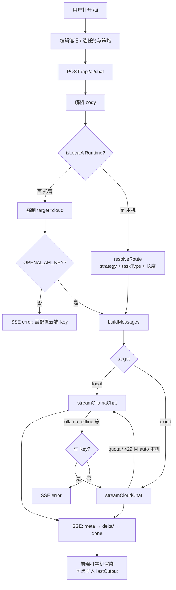

# 混合 AI 助手（Hybrid AI）Design Doc

状态：Demo 已落地（本机 Ollama + 云端 Gemini/OpenAI 兼容接口），笔记在浏览器本地；已扩展产线排查 Agent 与运行观测看板（见 §10）。  
入口：`/ai`（助手）、`/ai/runs`（运行看板）、`/fab`（产线数据）  
产品定位：**离线优先的笔记 + 流式对话助手**。简单任务默认走本地模型，复杂任务可路由到云端；托管环境（如 Vercel）一律走云端，绝不试图连接访客本机的 Ollama。在同一个 Gateway 上叠加了只读工具调用（查产线批次 / 告警）和每次调用的可观测记录。

---

## 1. 背景与目标

星迹 Demo 需要一块能讲清楚「端侧 / 混合 AI」的作品集能力，而不是再做一个完整 IDE 或 Agent 平台。

当前目标：

1. 用可演示的 Next.js 页面证明：**本地推理 + 云端兜底 + 显式路由 + SSE 流式交互**。
2. 路由规则可讲、可测：任务类型与策略按钮驱动，而不是黑盒「智能选模型」。
3. 本机断网 / Ollama 未启动、云端额度用尽等失败路径有清晰降级与提示。
4. 笔记与上次生成结果存在浏览器，刷新不丢，体现「离线优先」的存储侧。
5. 在同一 Gateway 上证明 **tool calling**：模型先查真实数据（产线批次 / 告警）再给结论，而不是凭空生成（§10 Step 2）。
6. 每次调用可观测：路由、降级、延迟、工具调用与用户反馈都有记录和看板（§10 Step 3）。

非目标（本阶段不做）：

- 多用户账号、服务端笔记库、协作编辑
- 写操作类工具（改数据 / 下指令）、多轮自主规划的通用 Agent、多文件代码库改造
- 浏览器直连访客本机 Ollama（需 CORS / 桌面壳，另开课题）
- 复杂 RAG、向量库、长期记忆

---

## 2. 适用场景

| 场景 | 走哪边 | 说明 |
| --- | --- | --- |
| 总结 / 润色 / 续写 / 翻译 / 打标签 / 闲聊 | 本地（本机 `auto`） | 短文本、成本与隐私优先 |
| 深度分析 / 重构建议 | 云端（本机 `auto`） | 更强推理，需配置 Key |
| 产线排查（`investigate`） | 云端（本机 `auto`） | 需要可靠的 tool calling；本地 Ollama 也可跑 |
| 输入 ≥ 约 2000 字 | 云端（本机 `auto`） | 长上下文倾向云端 |
| Vercel / 其他托管 | 云端 | 服务器碰不到访客的 `127.0.0.1:11434` |
| 用户选「仅本地」 | 本地（仅本机 runtime） | 线上会改走云端并说明原因 |
| 用户选「仅云端」 | 云端 | 无 Key 时本机可降级本地 |

不适合：

- 把「仅本地」当成线上隐私保证（线上没有本机模型）
- 依赖未配置的云端 Key 却期望托管环境可用
- 把 OpenClaw 等现成 Agent 产品当成整份交付物（本 Demo 要自建 Gateway）

---

## 3. 痛点陈述

### 3.1 演示 / 作品集

- 只调云端 API：体现不出端侧部署与降本。
- 只调 Ollama：线上 Demo 链接无法复现。
- 路由「玄学化」：面试时讲不清为什么走本地或云端。

### 3.2 工程

- Ollama 未启动、模型 404、云端 429 / 额度耗尽时，原始错误难读。
- 托管环境若误选本地，会得到「无法连接 127.0.0.1」的误导性错误。
- 流式输出若不用 SSE，前端难以做打字机体验与中途取消。

### 3.3 本 Demo 要证明的

- **规则路由优于黑盒**：`taskType` + `strategy` + 环境检测即可讲清路径。
- **失败可降级**：本地挂 → 云端；云端限流 → 本地（仅本机 `auto`）。
- **存储与推理解耦**：笔记在 `localStorage`，模型调用走 `/api/ai/chat`。

---

## 4. 工作流程

### 4.1 总览



约束：

- 浏览器只打 **同域** `/api/ai/chat`；Ollama / 云端 Key 只在 **Next 服务端** 使用。
- SSE 事件顺序：`run` → `meta` → （仅 `investigate`）`tool_call` / `tool_result`* → `delta*` → 可选 `error` → `done`。
- `investigate` 任务不走 `buildMessages → runModel`，而是进入 Agent（`agent.ts`）：一轮工具调用 → 流式输出 Action Plan；路由与降级逻辑与普通任务相同。
- 每次请求结束前把本次运行写入 `ai_runs`（见 §10 Step 3），写入失败不影响响应。
- 用户可 `AbortController` 取消生成。

### 4.2 代码层面

#### 页面与 API 入口

| 路径 | 文件 | 作用 |
| --- | --- | --- |
| `/ai` | `src/app/ai/page.tsx` + `AiChatPanel` | 笔记 UI、任务/策略、流式展示 |
| `POST /api/ai/chat` | `src/app/api/ai/chat/route.ts` | Hybrid Gateway（路由 + 调模型 + SSE） |

Next.js App Router：目录 `app/api/ai/chat/route.ts` 即 URL `/api/ai/chat`；导出 `POST` 即只接受 POST。

#### 核心模块

```
src/lib/ai/
  types.ts          AiTaskType / AiStrategy / StreamEvent / LOCAL_TASKS / CLOUD_TASKS
  router.ts         isLocalAiRuntime / resolveRoute / 模型名
  prompts.ts        按 taskType 组装 system + history + user
  ollama.ts         本机 Ollama /api/chat NDJSON 流
  cloud.ts          OpenAI 兼容 chat/completions SSE 流
  sse.ts            StreamEvent → text/event-stream
  errors.ts         统一 AiProviderError + 降级判定
  notes-storage.ts  localStorage 多笔记 CRUD
  agent.ts          investigate 任务：一轮 tool calling → 流式 Action Plan
  tools/            工具定义（OpenAI function 格式）+ 服务端执行器（只读 FAB 查询）
  runs.ts           ai_runs 运行记录、反馈、统计（SQLite）

src/lib/fab/        产线演示库：db（建表 + 种子）/ queries / types
src/lib/data-path.ts  SQLite 文件位置：本机 ./data，托管环境临时目录
```

Gateway 以动态 `import()` 加载 `agent.ts` 与 `runs.ts`：普通对话不依赖 `node:sqlite`，即便运行时缺少 SQLite 也不会影响基础聊天。

数据流：

```
AiChatPanel
    │  fetch POST { input, taskType, strategy }
    ▼
/api/ai/chat  (Gateway)
    │  resolveRoute → buildMessages → runModel
    ├──────────────┬──────────────┐
    ▼              ▼              ▼
 ollama.ts     cloud.ts      errors.ts
    │              │
    └──────┬───────┘
           ▼
     SSE StreamEvent
           ▼
   AiChatPanel 增量渲染
```

#### 路由决策（`resolveRoute`）

实现：`src/lib/ai/router.ts`。

优先级：

1. **非本机 runtime** → 永远 `cloud`（有无 Key 只影响能否真正请求成功）。
2. **`only-local` / `only-cloud`** → 用户开关；云端无 Key 时本机可落到本地。
3. **`auto`（本机）**：
   - `taskType ∈ CLOUD_TASKS`（`analyze` / `refactor`）→ 云端
   - `inputLength ≥ LONG_INPUT_CHARS`（2000）且为本地类任务 → 云端
   - 否则 → 本地

环境检测 `isLocalAiRuntime`：

- `AI_FORCE_CLOUD=1` → 非本机
- `AI_FORCE_LOCAL=1` → 本机
- `VERCEL=1` / `VERCEL_ENV` / Lambda / Netlify → 非本机
- 默认 → 本机

#### 降级（Gateway 内二次尝试）

| 条件 | 行为 |
| --- | --- |
| `via=local` 且 `ollama_offline` / `model_unavailable` / `network`，且有 Key | 提示后改走云端 |
| `via=cloud` 且 `quota_exhausted` / `rate_limited`，且本机 + `auto` | 提示后降级本地 |
| 托管且无 Key | 直接 SSE error，**不**尝试 Ollama |

#### 持久化（笔记，无后端）

Key：`startrail-ai-notes-v1`  
结构：`NotesStore`（`version: 1`，`activeId`，`notes[]`）

- 多笔记：新建 / 切换 / 删除
- 字段：`title`、`body`、`updatedAt`、`lastOutput`
- 与模型调用解耦：无 Key、Ollama 挂掉时笔记仍在

无服务端同步；清站点数据或换浏览器即丢失。

---

## 5. 协议与类型

### 5.1 请求体

```ts
{
  input: string;           // 必填，笔记正文
  taskType?: AiTaskType;   // 默认 chat
  strategy?: AiStrategy;   // auto | only-local | only-cloud，默认 auto
  messages?: ChatMessage[]; // 可选历史（当前 UI 未强依赖多轮）
}
```

### 5.2 SSE `StreamEvent`

| type | 含义 |
| --- | --- |
| `run` | 本次运行 id，前端用于提交反馈（首个事件） |
| `meta` | `via` / `model` / `reason`，可出现多次（降级后会再推） |
| `tool_call` | Agent 调用的工具名与参数（仅 `investigate`） |
| `tool_result` | 工具是否成功 + 结果预览（截断到约 480 字符） |
| `delta` | 增量文本 |
| `error` | `message` + 可选 `code` / `hint` / `retryable` |
| `done` | 结束 |

响应头（便于调试）：`X-AI-Via`、`X-AI-Model`、`X-AI-Local-Runtime`、`X-AI-Cloud-Configured`、`X-AI-Agent`、`X-AI-Run-Id`。

### 5.3 任务与策略（UI）

| 任务 | UI 倾向 | `auto` 默认 |
| --- | --- | --- |
| 总结 / 润色 / 续写 / 翻译 / 标签 / 自由问答 | 本地 | local |
| 深度分析 / 重构建议 | 云端 | cloud |
| 产线排查 | 云端 | cloud（Agent + 工具调用） |

---

## 6. 配置与部署

### 6.1 本机

1. Node.js ≥ 22.13（`node:sqlite` 内置模块，已写入 `package.json` 的 `engines`）。
2. 安装并启动 [Ollama](https://ollama.com)，拉取 `gemma4:latest`（或改 `OLLAMA_MODEL`）。
3. 复制 `.env.example` → `.env.local`，按需填云端 Key。
4. `npm run dev` → `http://localhost:3000/ai`。
5. SQLite 文件自动建在 `data/`（`fab.db`、`ai-runs.db`，已 gitignore）；`npm run seed:fab` 可重置产线数据。
6. Ollama 重启后首次本地请求需冷加载模型（实测可达 100 s 级），演示前先跑一次预热。

### 6.2 Vercel

在 Project → Environment Variables（Production）配置：

```env
OPENAI_API_KEY=...
OPENAI_BASE_URL=https://generativelanguage.googleapis.com/v1beta/openai
CLOUD_MODEL=gemini-3.1-flash-lite
```

改变量后需 Redeploy。线上**不能**使用访客本机 Ollama。

托管环境项目目录只读：SQLite 自动改写到系统临时目录（`src/lib/data-path.ts`）。产线数据每次冷启动重新种子化；运行记录只在单个实例内有效，冷启动或多实例间不共享——线上看板仅作演示，持久化需换托管数据库。

可选覆盖：`AI_FORCE_CLOUD=1` / `AI_FORCE_LOCAL=1`（后者在托管环境仍无法真正连到用户电脑上的 Ollama）。

---

## 7. 验收标准（Demo）

1. 本机 `auto` +「总结」：`meta.via === local`，能流式出字。
2. 本机 `auto` +「深度分析」：`meta.via === cloud`（已配 Key）。
3. 本机关掉 Ollama 后再总结：提示后降级云端（已配 Key）或可读错误。
4. 托管环境：响应不出现「连接 127.0.0.1 Ollama」；无 Key 时明确要求配置环境变量。
5. 刷新 `/ai`：笔记与 `lastOutput` 仍在。
6. 生成中点「停止」：请求中止，不崩溃。
7. 「产线排查」输入 B7 良率问题：先出现 `tool_call` / `tool_result` 轨迹，Action Plan 引用真实批次号 / 告警码。
8. 任意一次生成后 `/ai/runs` 多一条记录（路由、状态、首字延迟、总耗时、工具次数正确）。
9. 点「有帮助 / 没帮助」后刷新看板，满意度与该条记录的反馈同步更新。

---

## 8. 风险与后续

| 风险 | 缓解 |
| --- | --- |
| 公共/免费云端额度不稳定 | 错误分类 + 本机降级；文档写清模型 ID |
| 托管误走本地 | `isLocalAiRuntime` + Gateway 强制云端 |
| 规则路由过于简单 | 刻意为之，便于讲解；后续可加轻量分类模型 |
| 笔记仅本机 | 可接受 Demo；后期再上账号与服务端存储 |
| Agent 只做一轮工具调用 | 刻意取舍：规避 Gemini 多轮 `thought_signature` 问题；模型不调工具时强制拉取概况 / 告警 / 批次 |
| 模型编造数据 | 工具只读、系统提示要求只引用工具结果；UI 展示调用轨迹便于核对 |
| 线上 SQLite 在临时目录 | 冷启动即重置；持久化需改托管数据库 |
| 本地冷启动慢 | 看板暴露首字延迟；演示前预热模型 |

可选下一阶段：

- Docker Compose + 简单 CI（§10 Step 4）
- 离线评测集：固定问题 + 期望引用的批次 / 告警，自动打分 Agent 答案
- 多轮对话真正接上 `messages` 历史裁剪
- 浏览器侧「仅本地」探针（需用户启动带 CORS 的本地代理或桌面壳）
- Token / 成本估算展示
- 与星迹明星内容联动（例如「总结当前艺人时间线」）

---

## 9. 相关文件速查

| 文件 | 说明 |
| --- | --- |
| `src/app/ai/page.tsx` | 页面壳 |
| `src/components/ai-chat-panel.tsx` | UI + SSE 消费 |
| `src/app/api/ai/chat/route.ts` | Gateway |
| `src/lib/ai/router.ts` | 环境检测与路由 |
| `src/lib/ai/ollama.ts` / `cloud.ts` | Provider |
| `src/lib/ai/prompts.ts` | Prompt 组装 |
| `src/lib/ai/errors.ts` | 错误与降级判定 |
| `src/lib/ai/notes-storage.ts` | 笔记存储 |
| `src/lib/ai/agent.ts` | 产线排查 Agent |
| `src/lib/ai/tools/*` | 工具定义与执行器 |
| `src/lib/ai/runs.ts` | 运行记录 / 反馈 / 统计 |
| `src/lib/fab/*` | 产线演示库 |
| `src/lib/data-path.ts` | SQLite 文件位置 |
| `src/app/fab/page.tsx` + `src/app/api/fab/*` | 产线看板与查询 API |
| `src/app/ai/runs/page.tsx` + `src/components/ai-runs-content.tsx` | 运行看板 |
| `src/app/api/ai/runs/**` | 运行记录与反馈 API |
| `.env.example` | 环境变量模板 |
| `README.md` | 启动与线上配置摘要 |

---

## 10. JD 对齐路线（Manufacturing Co-pilot）

目标：在现有 Hybrid Gateway 上往「产线助手」切片靠拢，而不是重写产品。

| 阶段 | 内容 | 状态 |
| --- | --- | --- |
| **Step 1** | 假产线 SQLite（batches / alerts）+ `/api/fab/*` + `/fab` 页 | **已落地** |
| **Step 2** | Tool-calling Agent（查批次/告警 → Action Plan） | **已落地** |
| **Step 3** | Run 观测看板（via / 延迟 / 反馈） | **已落地** |
| Step 4 | Docker Compose + 简单 CI | 未开始 |

### Step 1 细节

- DB 文件：`data/fab.db`（gitignore；首次读写自动 seed，也可 `npm run seed:fab`）
- 引擎：Node 内置 `node:sqlite`（`DatabaseSync`），无需原生 npm 包
- 模块：`src/lib/fab/{db,queries,types}.ts`
- API：
  - `GET /api/fab/summary`
  - `GET /api/fab/batches?limit=`
  - `GET /api/fab/alerts?limit=&openOnly=`
- UI：`/fab` 展示 KPI、按日良率、最近批次与告警
- 故事线：Etch Chamber B7 近几日良率下滑 + particle / yield 告警，供后续 Agent 演示归因

### Step 2 细节

- 任务类型：`investigate`（自动路由倾向云端；本地 Ollama 也支持 tools）
- 工具（只读，执行层在服务端）：
  - `get_fab_summary`
  - `list_fab_batches`
  - `list_fab_alerts`
  - `get_fab_batch`
- Agent：`src/lib/ai/agent.ts` — 一轮 tool 调用（模型选择；失败则强制 summary/alerts/batches）→ 流式 Action Plan；避免 Gemini 多轮 `thought_signature` 问题
- Provider：`completeCloudChat` / `completeOllamaChat`（非流式 + tools）→ 最终答案再流式输出
- SSE：`meta` → `tool_call` / `tool_result`* → `delta`* → `done`
- UI：AI 页任务「产线排查」展示工具调用轨迹 + Action Plan
- 文件：`src/lib/ai/tools/{types,fab,registry}.ts`、`src/lib/ai/agent.ts`

### Step 3 细节

- 目标：让「路由是否合理、降级多不多、本地 vs 云端多快、答案有没有用」可以用数据回答，而不是靠感觉。
- 记录点：Gateway 每次 `POST /api/ai/chat` 写一行 `ai_runs`（SQLite，`data/ai-runs.db`；托管环境写临时目录）
  - 路由：`task_type`、`strategy`、`initial_target`（首选）、`via` / `model`（最终）、`reason`、`fell_back`
  - 结果：`status`（`ok` / `error` / `aborted`）、`error_code`
  - 性能：`ttft_ms`（首字延迟）、`total_ms`、`input_chars` / `output_chars`、`tool_calls`
  - 质量：`feedback`（1 / -1，用户在 AI 页点「有帮助 / 没帮助」）
- 状态判定：客户端中止 → `aborted`；有输出 → `ok`（即使中途降级过）；无输出 → `error`
- 记录失败只打日志，不影响对话；客户端断开后仍会落库
- SSE：新增首个事件 `run { id }`，响应头 `X-AI-Run-Id`，前端据此提交反馈
- API：
  - `GET /api/ai/runs?limit=` → `{ stats, runs }`
  - `POST /api/ai/runs/:id/feedback`，body `{ score: 1 | -1 | 0 }`（0 清除）
- 看板：`/ai/runs` — 运行次数、本地占比、降级率、失败率、首字 P50、满意度；按路由的首字 / 总耗时 P50 / P95；按任务分布；最近 25 次明细
- 口径：统计窗口为最近 500 次；延迟只算成功的运行
- 文件：`src/lib/ai/runs.ts`、`src/lib/data-path.ts`、`src/app/api/ai/runs/**`、`src/app/ai/runs/page.tsx`、`src/components/ai-runs-content.tsx`
- 实测例子：Ollama 刚重启后首次本地总结首字延迟约 108 s（冷加载模型），云端产线排查约 6 s——看板能直接暴露这类问题
