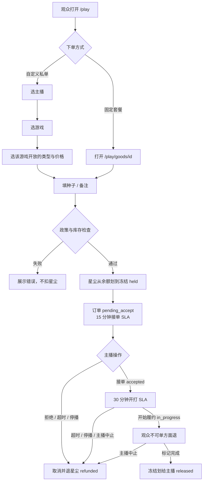

# 点播（Play Request）Design Doc

状态：Demo 已落地（浏览器本地），尚未接真实支付 / 账号 / 后端。  
入口：`/play`  
参考模型：B 站「帮我玩」的商品 / 虚拟货币 / 订单。站内货币叫 **星尘**（英文 Stardust），与「星迹」同名；代码字段仍用 `tickets`，避免清掉本地 Demo 数据。**明确排除上分、代练、账号共享**。

---

## 1. 背景与目标

Twitch 没有类似 B 站「帮我玩」的付费点播。本功能让观众向主播下可履约的游戏请求，主播用自己的号直播完成，或双方各自登录联机。

当前目标：

1. 用可点的 Demo 验证「商品 + 星尘托管 + 订单状态机」是否说得通。
2. 把可接范围锁死在四种类型：指定种子、挑战、联机、直播点播。
3. 价格和类型按 **主播 × 游戏** 配置，游戏是类型的前提。

非目标（本阶段不做）：

- 真实支付、礼物兑换、主播分成结算
- 登录账号、OAuth、主播审核后台
- 上分 / 代练 / 排位代打 / 登录观众账号
- 服务端权威订单（现在全部在浏览器 `localStorage`）

---

## 2. 适用场景

适合「主播用自己的存档或双方各自登录就能完成」的请求。

| 类型 | 适用 | 典型例子 |
| --- | --- | --- |
| `seed` 指定种子 | 游戏有公开种子 / seed code | 我的世界开荒、以撒的结合一局、杀戮尖塔开跑 |
| `challenge` 挑战 | 规则可写进备注、主播自己打完 | 半心生存、速通村庄、限定角色 |
| `coop` 联机 | 双方用自己的号加好友开档 | 星露谷物语联机种田 |
| `onstream` 直播点播 | 主播已有或能买到的单机 | 点一款独立游戏直播拆 |

不适合：

- 排位上分、代练、借号、租号、账号密码
- 需要登录观众账号才能完成的内容
- 主播该游戏并未开放的类型（例如星露谷物语不接指定种子；以撒不接联机）

目录里用「主播 × 游戏 × 类型」表达供给差异，而不是全站统一菜单。示例：

- 麦田种子手 / 我的世界：种子、挑战、点播（无联机）
- 肉鸽实验室 / 以撒的结合：种子、挑战
- 肉鸽实验室 / 杀戮尖塔：种子、点播
- 晚风农场 / 星露谷物语：联机、挑战、点播（无种子）

---

## 3. 痛点陈述

### 3.1 观众侧

- 想看指定种子或规则挑战时，只能弹幕求情，主播不一定看到，也没有价格和是否接单的约定。
- 打赏后没有履约约束：主播可以不接、中途停播，钱已经出去。
- 不知道这位主播到底接哪款游戏、哪几种类型，填错需求等于白等。
- 联机场景容易被引导成「把账号密码发过来」，安全风险高。

### 3.2 主播侧

- 弹幕点播无法排队，直播中途被连续打断。
- 没有按游戏拆开的报价：以撒种子和尖塔种子成本不同，却只能口头说一个价。
- 停播或来不及接时，没有自动退款路径，容易被投诉。
- 不想碰账号共享，但缺少产品层拦截，观众仍会把代练需求写进备注。

### 3.3 产品侧（本 Demo 要证明的）

- 先冻结星尘、履约后再结算，比「下单即扣死」更适合直播即时履约。
- 游戏必须先于类型随所选游戏变化，避免选了「联机」却配到没有联机的游戏。
- 违规需求要在下单时拦截，而不是事后人工删单。

---

## 4. 工作流程

### 4.1 总览

角色在 Demo 里都在同一浏览器完成：观众走大厅 / 订单页，主播走工作台并切换 `actingStreamerId`。



星尘规则：

| 情况 | 星尘 |
| --- | --- |
| 下单成功 | 余额减少，订单 `funds = held` |
| 拒绝、超时未接、停播、接单后未开打、开打前观众取消、主播中止 | `refunded`，余额加回 |
| 已开打后观众取消 | 不允许 |
| 标记完成 | `released`，不退回观众 |

约束：

- 每位主播同时最多 **3** 笔冻结中的排队订单（`pending_accept` + `accepted`）。
- 待接单 SLA：**15 分钟**；接单后未开打 SLA：**30 分钟**。超时由前端每 5 秒扫描，以 `system` 身份取消并退星尘。
- 演示星尘初始 40，每次兑换 +10，上限 80。无真实货币。

自定义下单字段顺序：**主播 → 游戏 → 类型**。类型选项和价格来自该主播 `offers[]` 里对应游戏的 `kindPrices`。换游戏会丢掉该游戏不开放的类型。

### 4.2 代码层面

#### 页面与数据入口

| 路由 | 组件 | 数据 |
| --- | --- | --- |
| `/play` | `PlayHall` | `getPlayCatalog()`：主播 + 在售商品 |
| `/play/goods/[id]` | `GoodsOrderForm` | `getGoodsById` + `getStreamerById` |
| `/play/orders` | `ViewerOrders` | 本地 `PlayStore.orders` |
| `/play/studio` | `StudioBoard` | 同上，按 `actingStreamerId` 过滤 |

`src/app/play/layout.tsx` 读取主播列表，包一层 `PlayShell` → `PlayProvider`。目录是构建期 / 请求期读文件，不是 API：

```
content/play/catalog.json
        ↓
src/lib/play/catalog.ts   getPlayCatalog / getPlayStreamers
        ↓
Server Component pages
        ↓
Client components + PlayProvider
```

文案不走目录 JSON：UI chrome、游戏名、主播展示名、套餐标题在

- `src/lib/i18n/messages/zh.json`
- `src/lib/i18n/messages/en.json`

目录里的 `game` 是稳定英文 ID（如 `Minecraft`、`The Binding of Isaac`、`viewer-pick`），界面用 `gameLabel()` 翻译。

#### 核心模块

```
src/lib/play/
  types.ts          PlayKind / Streamer.offers / Goods / PlayOrder
  catalog.ts        读 JSON，过滤未上架与政策违规商品
  pricing.ts        offeredGames / offeredKinds / kindPrice / featuredShortcut
  policy.ts         禁止上分代练等关键词；校验 seed / game / details
  order-machine.ts  状态转移、是否退款、SLA、排队上限
  storage.ts        localStorage 读写 PlayStore
  play-context.tsx  下单、接单、超时、兑换、模拟停播
  labels.ts         类型 / 状态 / 游戏 / 主播 / 套餐的 i18n
  errors.ts         错误码 → 文案
```

定价（私单）：

```
kindPrice(streamer, game, kind)
  → streamer.offers.find(game).kindPrices[kind]
```

未配置的类型视为不接，`placePrivateOrder` 返回 `kind_not_offered`。

大厅快捷条 `featuredShortcut`：统计在售商品里最多的 `kind`，再找一位正在直播、且该游戏开放此类型的主播，一键填入表单（主播 + 游戏 + 类型）。

#### 订单状态机

实现：`src/lib/play/order-machine.ts`。  
动作入口：`PlayProvider.actOnOrder` / `expireOverdue` / `goOfflineAndRefund`。

```
pending_accept --accept--> accepted --start--> in_progress --complete--> completed
      |                      |                    |
    reject                 cancel               cancel
    cancel                 (viewer / streamer /   (streamer / system)
    (viewer / streamer /    system)
     system)
```

退款判定 `shouldRefund`：仅 `funds === held` 时考虑；`complete` 改为 `released`；观众只在 `pending_accept` / `accepted` 可退；`in_progress` 仅主播或系统可退。

超时扫描在 `PlayProvider`：`ready` 后立刻跑一次 `expireOverdue`，之后 `setInterval(5000)`。到期条件：

- `pending_accept` 且 `now >= acceptBy` → `cancel` + `timeout`
- `accepted` 且 `now >= startBy` → 同上
- 工作台「模拟停播」对排队中订单 `cancel` + `offline`

#### 持久化（当前，无后端）

Key：`startrail-play-orders-v1`  
结构：`PlayStore`（`version: 2`，`tickets`，`actingStreamerId`，`orders[]`）

下单成功时：

1. `assertOrderAllowed`（政策 + 必填）
2. 余额 ≥ 价格
3. 该主播冻结排队 < 3
4. 生成 UUID 订单，`status = pending_accept`，`funds = held`，扣余额
5. `useEffect` 把整个 store 写回 `localStorage`

没有服务端校验，刷新本机仍在，清站点数据或换浏览器即丢失。多标签页会互相覆盖，不以 last-write-wins 之外的方式同步。

#### 下单 UI 同步规则

`PrivateOrderForm`：

1. 主播变化 → 游戏重置为该主播 `offeredGames()[0]`，类型重置为该游戏 `offeredKinds()[0]`
2. 游戏变化 → 若当前类型不在新列表中，切到该游戏第一个类型
3. 提交按钮展示 `kindPrice(streamer, game, kind)`

固定套餐不走私单报价，直接用 `goods.priceTickets`。

---

## 5. 后端调用 API

**当前：点播链路没有后端 API。** 站点里仅有的 Route Handler 是 AI 助手 `POST /api/ai/chat`，与点播无关。

目录、价格、政策、订单、星尘全部在 Next.js 服务端读静态 JSON + 浏览器本地状态机完成。

若以后把 Demo 做成可运营服务，建议拆成下列接口（均未实现，仅规划）。鉴权按观众 JWT / 主播 JWT 分开。所有写操作以服务端状态机为准，SLA 用 worker / cron，不要依赖开着的浏览器页。

### 5.1 规划中的 API

| 方法 | 路径 | 调用方 | 说明 |
| --- | --- | --- | --- |
| `GET` | `/api/play/catalog` | 大厅、工作台 | 返回主播 `offers`、在售 `goods`、直播状态 |
| `GET` | `/api/play/tickets` | 壳层余额 | 可用余额 + 冻结中合计 |
| `POST` | `/api/play/tickets/redeem` | 演示兑换；正式环境改为支付回调 | 增加星尘；正式环境应删除或改成充值凭证核销 |
| `POST` | `/api/play/orders` | 大厅 / 商品页 | body：`goodsId` 或 `{ streamerId, game, kind, seed, details }`。服务端算价、政策检查、冻结星尘、写 `pending_accept` |
| `GET` | `/api/play/orders` | 订单页 | 当前观众的订单 |
| `POST` | `/api/play/orders/:id/cancel` | 订单页 | 观众取消；服务端执行 `viewerCanCancel` |
| `GET` | `/api/play/studio/orders` | 工作台 | 当前主播收到的单 |
| `POST` | `/api/play/studio/orders/:id/accept` | 工作台 | 接单，写入 `startBy` |
| `POST` | `/api/play/studio/orders/:id/reject` | 工作台 | 拒绝并退冻结 |
| `POST` | `/api/play/studio/orders/:id/start` | 工作台 | 开始履约 |
| `POST` | `/api/play/studio/orders/:id/complete` | 工作台 | 完成并 `released` |
| `POST` | `/api/play/studio/orders/:id/abort` | 工作台 | 主播中止并退款 |
| `POST` | `/api/play/studio/offline` | 工作台 / 停播 webhook | 退还未开打的排队单 |
| `POST` | `/api/play/internal/expire` | cron | 扫描 SLA，等价今天的 `expireOverdue` |
| `PUT` | `/api/play/studio/offers` | 主播后台（未做） | 更新某游戏的 `kindPrices` |

下单请求示例（规划）：

```json
{
  "streamerId": "str-roguelike-lab",
  "game": "The Binding of Isaac",
  "kind": "seed",
  "seed": "ABCD 1234",
  "details": ""
}
```

服务端必须重新查 `kindPrice`，不能信任客户端传来的票价。政策词表与今天 `policy.ts` 相同，并应同时扫中英文。

错误码沿用现有 `play.errors.*`（`tickets_insufficient`、`queue_full`、`kind_not_offered`、`policy_boost` 等），方便前后端共用 i18n。

### 5.2 明确不做的 API

- 任何「代打排位 / 登录观众账号 / 收集密码」的下单字段
- 客户端定价接口（价格只读目录，下单时服务端再算一次）

---

## 6. Telemetry（用户数据收集）

**当前：未埋点。** 订单只存在本机 `localStorage`，服务端看不到漏斗、拒单原因或 SLA 是否被用到。

下面按阶段规划。Demo 阶段可先打到浏览器 console 或本地队列；正式环境再接分析 SDK。默认 **不采集** 种子全文、备注原文、游戏内昵称——这些可能含隐私或可复现的档。

### 6.1 事件（计划）

| 事件名 | 触发 | 属性（允许） | 目的 |
| --- | --- | --- | --- |
| `play_hall_view` | 打开 `/play` | `locale` | 入口 UV |
| `play_featured_pin` | 点击最热快捷 | `streamer_id`, `game`, `kind` | 快捷条是否有用 |
| `play_game_select` | 私单改游戏 | `streamer_id`, `game`, `offered_kinds[]` | 验证「游戏为前提」是否减少误选 |
| `play_kind_select` | 私单改类型 | `streamer_id`, `game`, `kind`, `price` | 各游戏类型需求 |
| `play_order_submit_attempt` | 点提交 | `channel`: `private` \| `listed`, `streamer_id`, `game`, `kind`, `price` | 漏斗顶 |
| `play_order_submit_fail` | 下单失败 | 同上 + `reason` | `queue_full` / `policy_boost` / 余额不足占比 |
| `play_order_submit_ok` | 下单成功 | `order_id`, 同上 | 转化 |
| `play_order_accept` | 主播接单 | `order_id`, `wait_ms` | 接单时效 |
| `play_order_reject` | 主播拒绝 | `order_id` | 供给不匹配 |
| `play_order_start` | 开始履约 | `order_id`, `accept_to_start_ms` | 是否卡在已接未开打 |
| `play_order_complete` | 完成 | `order_id`, `price` | 成功履约 GMV（星尘） |
| `play_order_cancel` | 取消 | `order_id`, `actor`, `cancel_reason`, `from_status` | 退款结构 |
| `play_order_expire` | SLA 超时 | `order_id`, `from_status` | SLA 是否过严 |
| `play_studio_offline` | 模拟停播 | `refunded_count` | 停播退款是否被用 |
| `play_redeem` | 兑换演示星尘 | `tickets_after` | 仅 Demo |

`reason` / `cancel_reason` 用枚举，不上传用户输入文本。

### 6.2 建议的漏斗

```
大厅曝光 → 选主播 → 选游戏 → 选类型 → 提交尝试 → 成功冻结
                                              ↘ 失败原因分布
成功冻结 → 接单 → 开打 → 完成
         ↘ 拒绝 / 超时 / 观众取消 / 停播
```

关注指标（上线后）：

- 私单因「该游戏无此类型」被改选的次数（`play_game_select` 后 `kind` 变化）
- `policy_boost` 拦截率：过高说明入口文案不够清楚
- 超时退款率：过高则加大 SLA 或降低 `MAX_HELD_PER_STREAMER`
- 按 `game × kind` 的完成单量：指导主播报价和目录运营

### 6.3 隐私

| 可收集 | 不收集 |
| --- | --- |
| 主播 / 游戏 ID、类型、票价、状态、错误码、SLA 耗时 | 种子字符串、备注、游戏内昵称、账号密码（产品也不该有此字段） |
| 匿名 `viewer_id` / 登录后的内部用户 ID | 支付卡号（未来支付走渠道 token） |
| 语言 `locale` | 精确 IP 与设备指纹（除非风控另立方案） |

订单正文若上云，应与分析事件分库，保留期单独规定，不进 telemetry 管道。

---

## 7. 网站维护（计划）

当前维护面很小：改 JSON 后重启 / 刷新 dev server 即可。下面分「现在就能做」和「以后再加」。

### 7.1 现在（静态目录）

| 资产 | 位置 | 谁改 | 注意 |
| --- | --- | --- | --- |
| 主播供给 | `content/play/catalog.json` → `offers[]` | 站长 | `game` 用英文 ID；`kindPrices` 缺省即不接该类型 |
| 固定套餐 | 同文件 `goods[]` | 站长 | `listed: false` 即下架；标题需过 `policy.ts` |
| 中英文案 | `src/lib/i18n/messages/{zh,en}.json` | 站长 | 新游戏必须同时加 `play.games.<id>`；新主播加 `play.streamers.<id>`；新套餐加 `play.goods.<id>` |
| 政策词表 | `src/lib/play/policy.ts` | 开发 | 中英文一起加；改完要回归私单备注拦截 |
| SLA / 排队上限 | `order-machine.ts` 常量 | 开发 | `ACCEPT_SLA_MS` 15min，`START_SLA_MS` 30min，`MAX_HELD_PER_STREAMER` 3 |
| 演示星尘 | `storage.ts` | 开发 | 初始 40 / 兑换 10 / 上限 80 |

发布检查（手工即可）：

1. 每个 `offers.game` 都能在 i18n 里显示中英文名。
2. 每个在售 `goods.game` 对应该主播的 `offers`（或明确是展示用套餐，如 `viewer-pick`）。
3. 大厅私单：换游戏后类型列表变化，提交价与下拉价一致。
4. 备注写「代练」「boost」应被拒。
5. 中英文切换后大厅、套餐、订单卡不出现英文游戏 ID 或中文残留键名。

### 7.2 以后再加

1. **主播自助改报价**  
   工作台可开关某游戏的类型和票价，写回服务端；目录不再只靠 git。

2. **直播状态**  
   接直播平台 webhook / 轮询。停播自动走今天的 `goOfflineAndRefund`，不要只靠按钮模拟。

3. **运营后台**  
   审核新主播、下架违规套餐、调整全站禁止词、查看 telemetry 漏斗。与艺人「待审动态」inbox 分开，避免两套内容混在一个后台。

4. **多语言内容流程**  
   目录 ID 保持语言无关；展示文案继续放 i18n JSON。不要在运行时用大模型翻译 UI chrome（已否决）。新游戏名由人补中英官方译名。

5. **数据与备份**  
   订单上云后：日备、SLA worker 健康检查、`localStorage` 仅作未登录草稿。迁移期 `PlayStore.version` 继续兼容。

6. **合规文案**  
   大厅政策条、下单页「不要填密码」、关于页 `about.li3` 需与真实可接范围同步修改。

---

## 8. 当前限制

- 订单与星尘只在本机，不能跨设备、不能作为真实履约凭证。
- 观众 / 主播是同一浏览器里的角色切换，没有权限隔离。
- 超时退款依赖页面开着；关掉站点后 SLA 不会在后台继续跑。
- 固定套餐价格与私单 `kindPrices` 可能被人手改到不一致，目前没有自动对账。
- 无 telemetry，产品判断只能靠手工点。

这些问题都对应第 5–7 节的后端、埋点和维护计划，不在当前 Demo 范围内实现。
